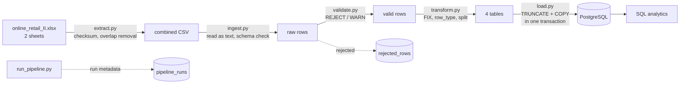

# Mini Data Pipeline


A tested, idempotent Python pipeline that turns a messy retail sales export into a
normalised PostgreSQL database and answers business questions with SQL.

## Problem

An online gift retailer exports its sales as a flat Excel file: one row per invoice line,
with customer, product and invoice details repeated on every row. Before anyone can trust
a sales report built on it, the data has to be checked, cleaned and modelled.

Profiling showed that the export is not only sales. It also contains cancellations,
stock corrections, accounting write-offs and fees, and the two sheets of the file overlap.
Loading it naively would double-count nine days of sales and mix non-sales rows into revenue.

## Architecture



| Step | What it does |
|---|---|
| Extract | Verifies the source file's SHA256, reads both sheets and removes the 9-day overlap between them |
| Ingest | Reads every column as text so one bad value cannot crash the run; checks the column layout |
| Validate | Applies row-level rules from the [data contract](docs/data_contract.md). Invalid rows go to `rejected_rows` with a reason |
| Transform | Fixes formatting, classifies each row (`row_type`) and splits the flat file into four tables |
| Load | Replaces all data with `COPY` inside one transaction, so a failed run leaves the previous data intact |
| Run metadata | Every run is recorded in `pipeline_runs` with row counts that must reconcile |

## Key results

| Metric | Value |
|---|---|
| Source rows (two sheets) | 1,067,371 |
| Overlapping rows removed | 22,523 |
| Invoice lines loaded | 1,044,848 |
| Rejected rows | 0 |
| Exact duplicates kept (flagged) | 11,812 |
| Tables | `customers` 5,942 · `products` 5,131 · `invoices` 53,628 · `invoice_lines` 1,044,848 |
| Net sales (sales − cancellations) | £18,981,261.52 |
| Full pipeline run | ~52 s on local development machine |
| Tests | 27 (unit + integration), run in CI |

## What the data revealed

- The two sheets overlap by nine days. A naive concat produced 34,335 exact duplicates.
  Removing the 22,523 overlap rows left 11,812, so every removed row was a duplicate and no real data was lost.
  `drop_duplicates()` would have been wrong: it also deletes genuine repeated purchases.
- The file contains five kinds of rows, not just sales.

  | `row_type` | Rows | Example |
  |---|---|---|
  | `sale` | 1,017,670 | Regular product line |
  | `cancellation` | 17,974 | Invoice starting with `C`, negative quantity |
  | `non_product` | 5,807 | Postage, bank charges, Amazon fees, gift vouchers, test products |
  | `stock_adjustment` | 3,391 | Negative quantity at price 0, notes like "damaged" — **−564,306 units** |
  | `accounting_adjustment` | 6 | "Adjust bad debt" — **−£147,614** |

- **22.5 % of lines have no customer**, always for the whole invoice, which points to guest checkouts rather than data loss.
- **One order of 80,995 units (£168,470) was cancelled 12 minutes later.** Keeping cancellations is what makes net sales correct.
- **The documentation did not match the file.** Column names differ from the UCI description, and `A` invoices are not documented at all.

Full findings: [docs/data_profiling.md](docs/data_profiling.md)

## Design decisions

| Decision | Why |
|---|---|
| Classify rows (`row_type`) instead of rejecting unusual ones | Stock adjustments and write-offs are valid data. Rejecting them would fill the quarantine with correct rows; classifying lets each report choose its rows. |
| REJECT only rows that cannot be loaded | Missing invoice number, unparseable date or quantity. Everything else is loaded and, if unusual, flagged. |
| Full refresh (`TRUNCATE` + `COPY`) instead of upsert | Invoice lines have no natural key (23,424 key duplicates), so rows cannot be matched across runs. One transaction keeps the database consistent if a run fails. |
| Surrogate key `line_id` | The same product can appear on the same invoice more than once |
| Price kept as text until the database | Avoids float rounding; PostgreSQL parses it into `NUMERIC(10,3)` exactly (some prices are £0.001) |
| `country` on invoices, not customers | 13 customers have several countries; every invoice has exactly one |
| No orchestrator (Airflow) | One script, one static dataset. A scheduler would add complexity without solving a real problem here |

## Tech stack

| Technology | Why |
|---|---|
| Python 3.12 + pandas | Profiling and row-level transformations of ~1 M rows fit comfortably in memory |
| PostgreSQL 17 | Relational model with keys and `CHECK` constraints as the last line of defence |
| psycopg 3 | Native `COPY` support: 1 M rows load in ~25 s instead of minutes with `INSERT` |
| Docker Compose | Reproducible database with a pinned version, schema created on first start |
| pytest | Unit tests for every rule plus integration tests against a real database |
| GitHub Actions | Runs all tests against a PostgreSQL service on every push |

## Project structure

```
mini-data-pipeline/
├── .github/workflows/ci.yml   # Tests on every push
├── data/                  # Source file and CSV (not in Git)
├── docs/                      # Data contract, profiling, data model, query performance
├── notebooks/                 # Data profiling notebook
├── sql/
│   ├── schema.sql             # Tables, constraints and indexes
│   └── analytics/             # Business and data quality queries
├── src/                       # Pipeline steps and run_pipeline.py
├── tests/                     # Unit and integration tests
├── docker-compose.yml
├── requirements.txt
└── requirements-dev.txt
```

## Getting started

**Requirements:** Python 3.12, Docker

1. Download the dataset from the [UCI Machine Learning Repository](https://archive.ics.uci.edu/dataset/502/online+retail+ii)
   and place `online_retail_II.xlsx` in `data/`. The pipeline verifies its SHA256 before reading it.
2. Create the environment file and start the database:
   ```bash
   cp .env.example .env        # set your own password
   docker compose up -d
   ```
3. Install dependencies:
   ```bash
   python -m venv venv
   source venv/bin/activate    # Windows: venv\Scripts\activate
   pip install -r requirements-dev.txt
   ```
4. Run the pipeline:
   ```bash
   python src/run_pipeline.py
   ```
5. Run the tests:
   ```bash
   python -m pytest -v
   ```

## Testing

- **Unit tests** cover every reject rule, the edge cases that must *not* be rejected
  (cancellations, write-offs, unknown customers), FIX rules, `row_type` ordering, and table building.
- **Integration tests** load data into a separate `retail_test` database and prove that
  running the load twice gives exactly the same result, and that values such as £0.001 survive unchanged.
- CI runs both on every push.

## Data quality

- [Data contract](docs/data_contract.md) defines expectations per column and the REJECT / WARN / FIX handling.
- Every run reconciles row counts: `read = valid + rejected` and `loaded = valid` (counted in the database).
- [`10_data_quality_checks.sql`](sql/analytics/10_data_quality_checks.sql) checks for orphan rows and rule violations.
- [`09_reconciliation.sql`](sql/analytics/09_reconciliation.sql) proves every row belongs to exactly one `row_type`:

```
       row_type        |  lines  |  units   |    value
 TOTAL (whole table)   | 1044848 | 10441844 | 18909762.12
 TOTAL (sum of types)  | 1044848 | 10441844 | 18909762.12
```

## SQL analytics

| Query | Business question | SQL concepts |
|---|---|---|
| [01](sql/analytics/01_monthly_net_sales.sql) | Monthly net sales and month-over-month change | CTE, `CASE`, `LAG` |
| [02](sql/analytics/02_top_products.sql) | Top 10 products | `JOIN`, `GROUP BY` |
| [03](sql/analytics/03_sales_by_country.sql) | Sales and share by country | `SUM() OVER ()` |
| [04](sql/analytics/04_top_products_per_country.sql) | Top 3 products in the 5 largest markets | `RANK() OVER (PARTITION BY)` |
| [05](sql/analytics/05_repeat_customers.sql) | Repeat customer rate (72.4 %) | `FILTER`, NULL handling |
| [06](sql/analytics/06_new_customers_per_month.sql) | New customers per month | Running total |
| [07](sql/analytics/07_cancellation_rate.sql) | Products with the highest cancellation rate | `HAVING` |
| [08](sql/analytics/08_customer_purchase_gaps.sql) | Days between repeat orders (median 25) | `LAG` per customer, median |
| [09](sql/analytics/09_reconciliation.sql) | Do all row types add up to the total? | `ROLLUP`, `UNION ALL` |
| [10](sql/analytics/10_data_quality_checks.sql) | Data quality checks | Anti-join |

Indexes on foreign keys cut a single-invoice lookup from 611 ms to 0.9 ms. See [docs/query_performance.md](docs/query_performance.md).

## Limitations

- **Full refresh does not scale** to very large or continuously growing data; it fits a one-time 1 M row dataset.
- **Static source.** The dataset is a one-time download, so incremental loading was not needed.
- **Product name = most frequent description.** A product that appears only in stock adjustments may get a stock note as its name.
- **Gift vouchers** are classified as `non_product`, an interim decision.
- **Timestamps are assumed to be UK local time**; the source has no timezone.
- **New customers in the first month** include existing customers, because the data starts in December 2009.
- **Exact duplicates are kept** because the data cannot tell a double write from a genuine repeat.

## Future improvements

- Incremental loading by date partition instead of full refresh
- Package the code with `pyproject.toml` and run the pipeline itself in Docker
- Machine-readable data contract (ODCS YAML) that drives validation directly

## What I learned

- **Real data is full of special cases.** Overlapping source sheets, five kinds of rows in one file and
  undocumented invoice types only showed up because I profiled the data before writing pipeline code.
- **Not every duplicate is an error.** Repeated lines were often real purchases, and deleting them would have
  understated sales. Deciding what to keep is a business question, not just a technical one.
- **Documentation drives the work.** Writing the data contract first gave every validation rule, test and
  table design a documented reason.
- **Exploring the data takes most of the time.** I learned to profile systematically with pandas in a notebook
  (`groupby`, `nunique`, `duplicated`, `value_counts`) instead of looking for problems at random.
- **A pipeline is many small, testable steps.** Extract, validate, transform and load each have one job.
  That structure is my plan for the next project: an automated pipeline in my home lab
  that prepares data for local AI and machine learning models.

## References

**Data**
- Chen, D. (2019). *Online Retail II* [Dataset]. UCI Machine Learning Repository.
  https://doi.org/10.24432/C5CG6D (CC BY 4.0)

**Standards followed**
- [Open Data Contract Standard](https://github.com/bitol-io/open-data-contract-standard): structure of the data contract


**AI assistance**
- I used Claude as a mentor, code reviewer and pair programmer. I ran, debugged and verified every step against the real database, and every design decision and its reasoning is documented in [docs/](docs/).