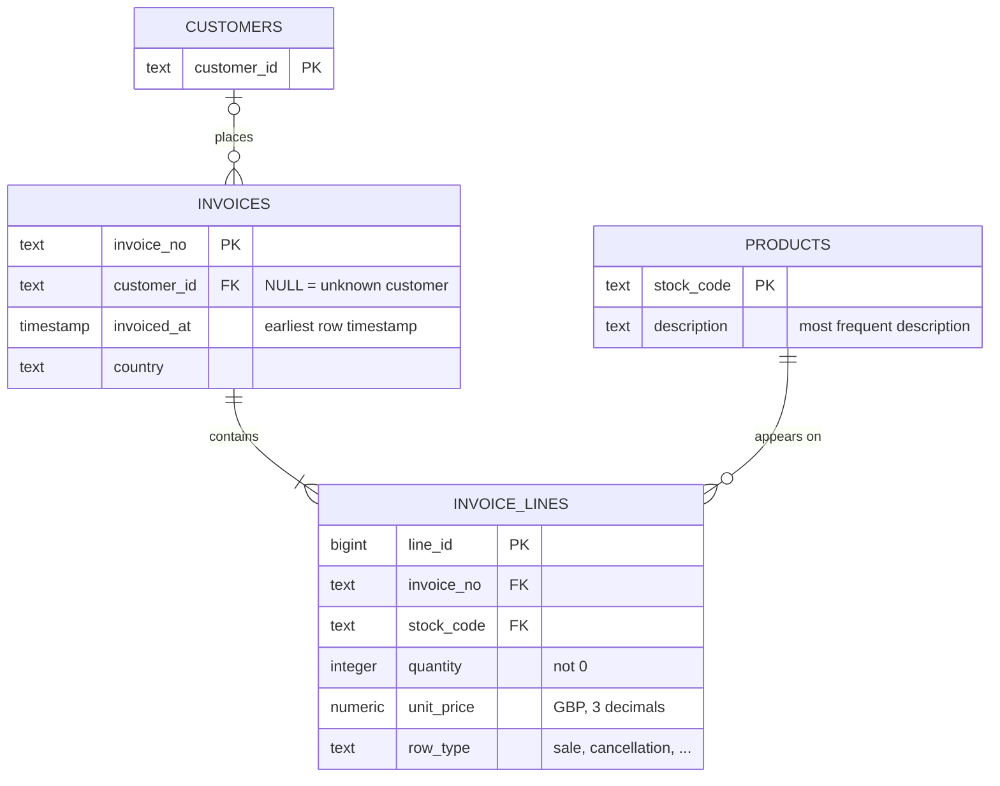

# Data Model

## Design decisions

| Decision | Reason |
|---|---|
| `country` on invoices, not customers | 13 customers have several countries; country is consistent within every invoice |
| Surrogate key `line_id` | Source has no unique row identifier |
| `row_type` on lines | One invoice can mix product and non-product lines |
| `customer_id` nullable | 22.5 % of lines have no customer (invoice-level) |
| `unit_price` with 3 decimals | Some prices are £0.001 |

